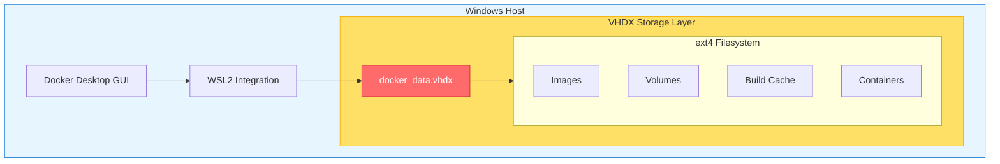
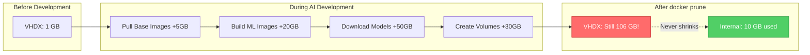
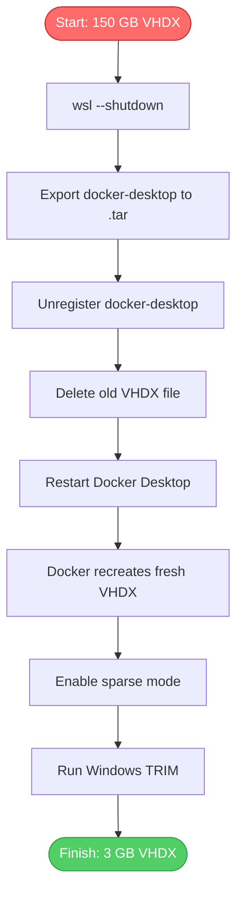
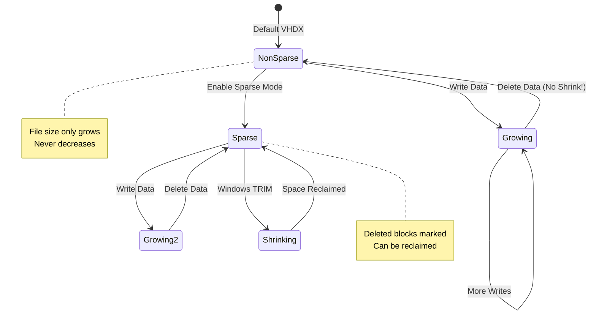
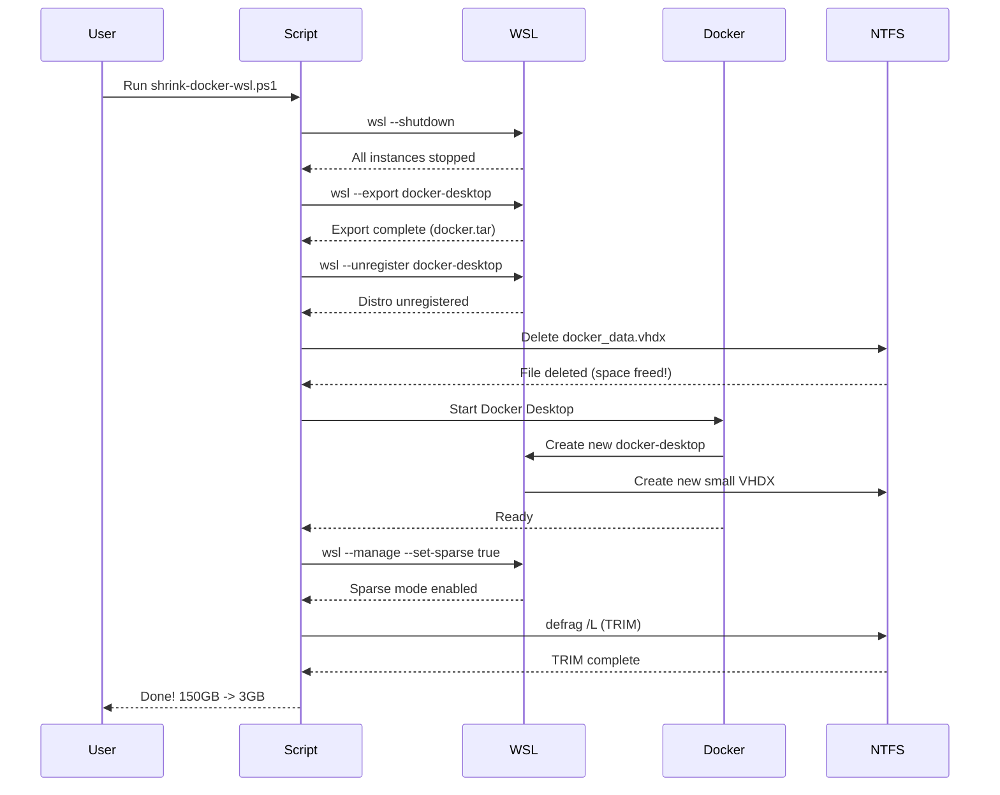
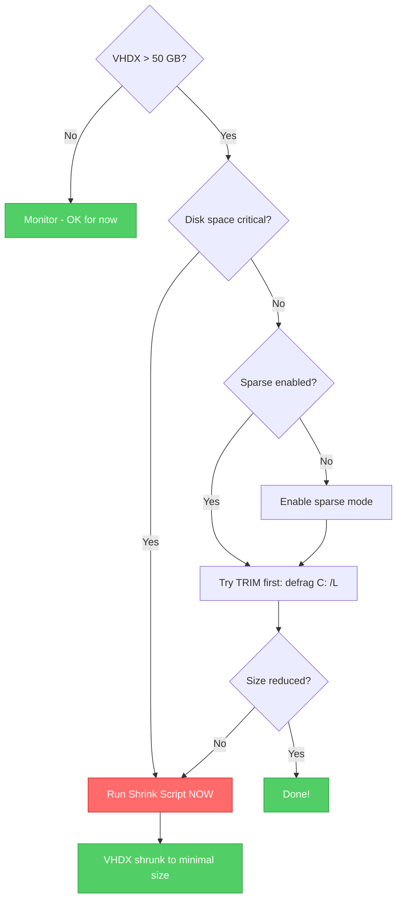

# Architecture Diagrams

These diagrams can be rendered using any Mermaid-compatible viewer (GitHub, VS Code extension, Mermaid Live Editor).

## Docker Desktop WSL2 Storage Architecture



## The Problem: Auto-Expand, Never Shrink



## The Solution: Export-Unregister-Import Workflow



## Sparse Mode Behavior



## Script Execution Flow



## Decision Tree: When to Shrink



---

## How to Render These Diagrams

### GitHub

GitHub automatically renders Mermaid diagrams in Markdown files.

### VS Code

Install the "Markdown Preview Mermaid Support" extension.

### Mermaid Live Editor

Visit [mermaid.live](https://mermaid.live) and paste the diagram code.

### Export to PNG

Use the Mermaid CLI:

```bash
npm install -g @mermaid-js/mermaid-cli
mmdc -i docs/mermaid-diagram.md -o assets/diagram.png
```
